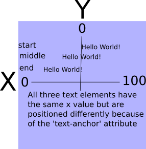

#SVG Basics
Scalable Vector Graphics are not only 'Scalable', they are powerful. Why are they powerful? They are defined in XML and as such every part is addressable through CSS and JavaScript. This means that we can take a single SVG and not only morph it's size, but everything about it. In this tutorial, I will not get remotely close to the endless capabilities of SVGs, but hope inspire further investigation and creativity on your part by showing how easy they are to use. See [MDN](https://developer.mozilla.org/en-US/docs/Web/SVG/Element) to explore the vastness of this technology.
##The Canvas
You may be familiar with the canvas element in HTML5. The SVG element can be analyzed in similar fashion. The SVG element is filled with other elements. Each can be manipulated together or individually providing an endless palette of possibilities.
Setting up the svg canvas is as simple as this ```<svg width="100" height="100"></svg>```. Just like that we have an 100X100px area in which to place a multitude of graphical interaction. We can add an id and address it with JavaScript. We can give it a class allowing us to manipulate it with CSS. ```<svg id="mySvg" class="svgClass" width="100" height="100"></svg>```. And of course we can do the same with the elements we place inside.
###Placement of Child Elements
####Basic Shapes
The figure below depicts the coordinates of a 100X100 svg. We use this system for placing our child shape elements.


This next figure shows a rectangle defined within the SVG. As you can see, the x and y attributes of the rectangle refer to where the upper left corner of the rectangle will be placed within the SVG. On the other hand, the cx and cy attributes of a circle refer to where the center of the circle will be placed within the SVG.


The cy and cx attributes of an ellipsis are used the same as the circle attributes. The circle, ellipsis, and rectangle fall into the category of basic shapes. There are three more basic shapes that we can use; line, polyline, and polygon. Their orientation within the SVG is illustrated below.


The line attributes are similar to the previous shapes. It uses x1 and y1 for the start point and x2 and y2 for the end point. The polyline coordinates are consolidated into one attribute called **points** containing all the points where the line changes direction. Each point is represented as x,y with a space separating each one. The polygon is intended to be filled in like rect, circle and ellipsis so while it uses the same attribute as polyline, the last point in the attribute is automatically connected to the first point. Because of this you can get some interesting results with this shape. A simple triangle is all we illustrate here, but I encourage you to experiment around with the polygon.
####Text
Text is another element we can place inside out svg allowing increasing the versatility by giving us the ability to label shapes or do all kinds of interesting things with fonts. Text has the basic x and y attributes like a rectangle. But it also has a special attribute that allows us to move point within the text to which the x,y intersection is attached. It is called **text-anchor** and is very handy for aligning text in relation to shapes. Valid values are start, middle and end. The figure below illustrates the difference between each.



By using the x coordinate in the center of a shape, we can keep text centered on the shape, no matter how long the text is, by setting the text-anchor attribute to **middle**. As you have probably noticed, shapes and text within an svg can occupy the same space. The elements within an svg are not HTML the are XML. XML does not have a z-index attribute so how do we determine who's visible when occupying the same space? The las element defined within the svg is the one that will overlap all elements sharing its space. Because of this, it is usually a good idea to make sure the text element is the last element defined in the svg.
###CSS and SVGS
###JavaScript and SVGS
