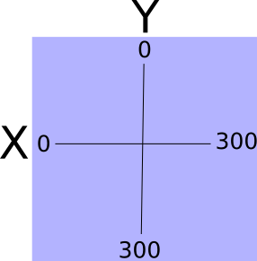
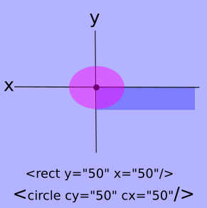

#SVG Basics
Scalable Vector Graphics are not only 'Scalable', they are powerful. Why are they powerful? They are defined in XML and as such every part is addressable through CSS an JS. This means that we can take a single SVG and not only morph it's size, but everything about it. In this tutorial, I will not get remotely close to the endless capabilities of SVGs, but hope inspire further investigation and creativity on your part by showing how easy they are to use. See [MDN](https://developer.mozilla.org/en-US/docs/Web/SVG/Element) to explore vastness of this useful technology.
##The Canvas
You may be familiar with the canvas element in HTML5. I like to see the SVG element in similar fasion. The SVG element is filled with other elements, that each can be manipulated together or individually providing an endless palette of possibilities.
Setting up that canvas is as simple as this ```<svg width="100" height="100"></svg>```. Just like that we have an 100X100px area to place a multitude of graphical interaction. We can add an id address it with JavaScript, and we can give it a class to manipulate it with CSS. ```<svg id="mySvg" class="svgClass" width="100" height="100"></svg>```. And of course we can do the same with the elements we place inside.
###Sizing Things Up
The figure below depicts the coordinates of a 100X100 svg. We use this system for placing our inner elements.



This next figure shows a rectangle defined within the SVG. As you can see, the x and y attributes of the rectangle refer to where the upper left corner of the rectangle will be placed within the SVG. On the other hand, the cx and cy attributes of a circle refer to where the center of the circle will be placed within the SVG.



cy and cx for an ellipsis works the same as that of a circle. The circle, ellipsis, and rectangle fall into the category of basic shapes. Their are three more basic shapes that we can use; line, polyline, and polygon. Their orientation within the SVG is illustrated below.


The line attributes are similar to the previous shapes. It uses x1 and y1 for the start point and x2 and y2 for the end point. The polyline coordinates are consolidated into one attribute called **points** containing all the points where the line changes direction. Each point is represented as x,y with a space separating each one. The polygon is intended to be filled in like rect, circle and ellipsis so while it uses the same attribute as polyline, the last point in the attribute is automatically connected to the first point. Because of this you can get some interesting results with this shape. A simple triangle is all we illustrate here, but I encourage you to experiment around with the polygon.