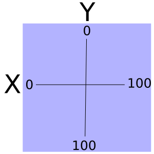

#SVG Basics
Scalable Vector Graphics are not only 'Scalable', they are powerful. Why are they powerful? They are defined in XML and as such every part is addressable through CSS and JavaScript. This means that we can take a single SVG and not only morph it's size, but everything about it. In this tutorial, I will not get remotely close to the endless capabilities of SVGs, but hope inspire further investigation and creativity on your part by showing how easy they are to use. See [MDN](https://developer.mozilla.org/en-US/docs/Web/SVG/Element) to explore the vastness of this technology.
##The Canvas
You may be familiar with the canvas element in HTML5. The SVG element can be analyzed in similar fashion. The SVG element is filled with other elements. Each can be manipulated together or individually providing an endless palette of possibilities.
Setting up the svg canvas is as simple as this ```<svg width="100" height="100"></svg>```. Just like that we have an 100X100px area in which to place a multitude of graphical interaction. We can add an id and address it with JavaScript. We can give it a class allowing us to manipulate it with CSS. ```<svg id="mySvg" class="svgClass" width="100" height="100"></svg>```. And of course we can do the same with the elements we place inside.
###Placement of Child Elements
####Basic Shapes
The figure below depicts the coordinates of a 100X100 svg. We use this system for placing our child shape elements.



This next figure shows a rectangle defined within the SVG. As you can see, the x and y attributes of the rectangle refer to where the upper left corner of the rectangle will be placed within the SVG. On the other hand, the cx and cy attributes of a circle refer to where the center of the circle will be placed within the SVG.


The cy and cx attributes of an ellipsis are used the same as the circle attributes. The circle, ellipsis, and rectangle fall into the category of basic shapes. There are three more basic shapes that we can use; line, polyline, and polygon. Their orientation within the SVG is illustrated below.


The line attributes are similar to the previous shapes. It uses x1 and y1 for the start point and x2 and y2 for the end point. The polyline coordinates are consolidated into one attribute called **points** containing all the points where the line changes direction. Each point is represented as x,y with a space separating each one. The polygon is intended to be filled in like rect, circle and ellipsis so while it uses the same attribute as polyline, the last point in the attribute is automatically connected to the first point. Because of this you can get some interesting results with this shape. A simple triangle is all we illustrate here, but I encourage you to experiment around with the polygon.
####Text
Text is another element we can place inside out svg allowing increasing the versatility by giving us the ability to label shapes or do all kinds of interesting things with fonts. Text has the basic x and y attributes like a rectangle. But it also has a special attribute that allows us to move point within the text to which the x,y intersection is attached. It is called **text-anchor** and is very handy for aligning text in relation to shapes. Valid values are start, middle and end. The figure below illustrates the difference between each.
In these examples all of our elements were added a siblings inside our svg tag. It is worth pointing out that we can also place shape and text elements inside other shape and text elements. When we do this, the sub shape or text will not be visible unless its coordinates fall within the same area that the parent element occupies. Lets say we had a circle with a radius of 20 and we placed it at 100,100. If we were to place a text element inside the circle declaration, the coordinates for the text element would need to fall within the area that the circle occupies. So if we set the text coordinates to 0,0 it would not be visible, even though it would ordinarily be visible on the canvas. We can think of the circle location as controlling the visibility of the text. If we had a number of shapes declared within a circle and their coordinates are spread all over the parent svg, we could use the circle like a flashlight. By moving its coordinates around it would illuminate what ever shapes fell inside the new area.


By using the x coordinate in the center of a shape, we can keep text centered on the shape, no matter how long the text is, by setting the text-anchor attribute to **middle**. As you have probably noticed, shapes and text within an svg can occupy the same space. The elements within an svg are not HTML the are XML. XML does not have a z-index attribute so how do we determine who's visible when occupying the same space? The las element defined within the svg is the one that will overlap all elements sharing its space. Because of this, it is usually a good idea to make sure the text element is the last element defined in the svg.
###The Scalable in SVG
The viewBox is an attribute that we can add to our SVG to do some interesting things. A viewBox attribute has four parameters that can be separated by commas or spaces. They are min-x, min-y, width, and height. Lets explore how these settings effect our svg. If we use the following settings: ```viewBox="0 0 *svg-width* *svg-height*``` we will observe that the view box attribute has no effect on the way our svg looks. However, if we were to change the min-x and min-y values something interesting occurs. Lets say we had the following svg defined:

```
<svg width="500" height="250" viewBox="0 0 500 250"><circle fill="#231670" cx="50" cy="50" r="50"/><circle fill="#D922F2" cx="500" cy="250" r="50"/>
  </svg>
```
You may want to drop this code into [jsBin](https://jsbin.com/yoyip/4/edit?html,output) and add the following css in order to see what is going on.
 
 ```
 svg {
   border-style:solid;
   border-size:2px;
   border-color:red;
 }
 ```
 
 The first circle resides right inside the upper left corner of the svg and so we can see the complete circle. Only the left quadrant of the second circle is visible how ever because the center of the circle resides lower right corner point of the svg. We can manipulate the values of the view box min-x and min-y to make the second circle. Using the radius of the circle we determine that if we move it 50 units to the left and 50 units up it will be visible. So if we give the viewBox min-X and min-y properties a value of 25 our second circle will become fully visible. However, now only the lower right quadrant of our first circle is visible. Using the viewBox attribute this way, we are able to navigate a canvas much larger than our svg height and width. It is like the page is laying on top of a larger page and we have cut a rectangle in our page so we can slide our page in various directions, revealing what is under it as we go. By increasing the value of min-x, we are moving page across the page behind toward the right. By increasing the value of min-y, we moving our page down the down across the page behind. Neat huh. If our svg does not have any elements defined inside of it who's coordinates are outside the bounds of the width and height of the svg, then moving the view box around will not reveal anything new and would only potentially hide elements who's coordinates exist within the svg's width and height.
 
 Now what if we leave our min-x and max-x values at 0(the upper left corner of the svg) and change the width to something other than the width of the svg, say something like 1500. Oh my, now we are seeing the scalable in svg at work. The circles both become visible as they become smaller in size. As we increase the values of the viewBox width and height, the shapes within the svg get increasingly smaller. But the circle do not stay at the extreme edges of the svg where we placed them, so not only do they shrink, but their position within the svg changes. What determines to where they move? If we decrease the width and height of the viewBox attribute below that of the svg our circles will grow larger will quickly move out of site.
  preserveAspectRatio

###CSS and SVGS
###JavaScript and SVGS
