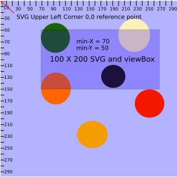
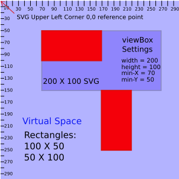
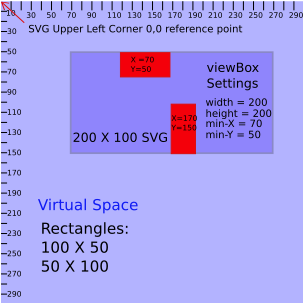

#Whats Behind the SVG viewBox?
A tutorial on the SVG viewBox *(a second in a series concerning SVGs)*

*Given the lack of resources available on the subject, writing a tutorial on the viewBox proved to be somewhat of a challenge. It required quite a bit of experimentation and analysis on my part. I hope that by reading this post you will save yourself quite a bit of time implementing the view box in your projects.*

###A Basic Description
The viewBox is an attribute that we can add to our SVG to do some powerful things. It provides us with an infinite land of virtual space in which to build an amazing user interface and experience. The viewBox attribute has four properties that can be separated by commas or spaces. They are **min-x**, **min-y**, **width**, and **height**. The following units can be used to define the values: em, ex, px, pt, pc, cm, mm, in, and percentages. If no unit is specified, px units are assumed. Lets explore how these settings effect our svg first by setting the viewBox height and width the same as the SVG height and width and varying the viewBox values for min-x and min-y. 

###X and Y
If we use the settings ```viewBox="0 0 svg-width svg-height``` we will observe that the view box attribute has no effect on the way our svg looks. However, if we we change the min-x and min-y values, things start to get interesting. Lets say we had the following svg defined:

    <svg width="500" height="250" viewBox="0 0 500 250">
        <circle fill="#231670" cx="50" cy="50" r="50"/>
        <circle fill="#D922F2" cx="500" cy="250" r="50"/>
    </svg>

You may want to drop this code into [jsBin](https://jsbin.com/yoyip/4/edit?html,output) and add the following css in order to visualize what is going on.
 
 ```
 svg {
   border-style:solid;
   border-size:2px;
   border-color:red;
 }
 ```
 
 The first circle resides right inside the upper left corner of the svg so we can see the complete circle. Only the upper left quadrant of the second circle is visible, however, because the center of the circle resides at the lower right corner point of the svg. We can manipulate the values of the view box **min-x** and **min-y** to make the second circle visible. Using the radius of the circle we determine that if we move it 50 units to the left and 50 units up it will be visible. So if we give the viewBox **min-X** and **min-y** properties a value of 50 our second circle will become fully visible. But, now only the lower right quadrant of our first circle is visible. What this demonstrates is that **we can move our SVG point of reference around within a much larger virtual space**. Changing the value of **min-X** and **min-Y** to 50 moves the SVG view 50 units to the right and 50 units down. So we learn two things from this example. One, the **viewBox attribute controls the viewing area of the SVG**. And two, **the elements we define within our SVG can exist outside the width and height boundaries of the SVG in virtual space**. Using the viewBox attribute this way, we are able to create a virtual space much larger than that of our SVG. In summary, the min-X and min-Y properties of the viewBox attribute make the SVG a a window into virtual space where the min-X and min-Y values correspond to the placement of the upper left corner of the window within that space. Increasing values of min-X move the window to the right and increasing values of min-Y move the window down. The relationship is illustrated below.
 
 
 
 **Figure A**
 
 Referring back to our JSBin example, what if we wanted to expand our window to include both of our circles simultaneously. We might try to merely increase the width and height of our viewBox to give us a larger view of our virtual space. Set min-y and min-x back to 0. Then set the viewBox height to 300. This will exposes the entire lower circle and also leave the upper circle exposed. But what happened to the position of the upper circle? We only changed the viewBox height and the upper circle appears to have moved to the right. That's not what we want. Why did the virtual space expand horizontally as well as vertically? It will be easier see what happens if we add a rectangle with the same dimensions as our SVG. Add the the following code as the last line inside of our SVG.
  
     <rect x="0" y="0" width="550" height="300"/>
 Let's also set our second circle coordinates back to their original settings. Our SVG should now look like this:
 
    <svg width="550" height="300" viewBox="0 0 550 300">
        <circle fill="#231670" cx="50" cy="50" r="50"/>
        <circle fill="#D922F2" cx="550" cy="300" r="50"/>
        <rect x="0" y="0" width="550" height="300"/>
    </svg>

 The rectangle will completely fill the area of our SVG. Now if we increase the viewPort height by 50, we can see that the lower circle comes into view with its upper left quadrant covered by the rectangle. Remember that without the rectangle, when the viewBox and SVG dimensions are equal, the upper right quadrant of the circle was all that was visible. Notice also that the rectangle is centered within the SVG border and 50 units of space separate the bottom of the rectangle from the SVG border. If we continue to increase the height value of our viewPort, we will find that the rectangle and the visible part of circle 2 continue to appear smaller, but their spacial relationships with other elements stay the same. The rectangle stays attached to the top border and the circle remains attached to the rectangle. By increasing the height value of our viewBox, we move the virtual space behind our SVG further away while maintaining the anchor point corresponding to the top of the SVG. All the additional virtual space added inside our SVG is limited to the area below the anchor point. The space added to the width is split evenly between the right and the left sides of the SVG Y axis. Yes I did say the left side of the Y axis.
 
 A similar expansion occurs if we set the height of our viewBox to match the SVG and increase our viewBox width beyond the width of the SVG. Try it and you will see that the only difference in this case is that the anchor point with the left side of the SVG is maintained as the virtual space is expanded above, below and to the right. Consider the following images:
  
  In the image below our viewBox height and width match that of the SVG. Notice how min-x and min-y values move the view box around within a larger virtual space. As you will see later, it is also important to note how the x and y values of the shape elements are mapped here within the SVG.
  
  
  
  **Figure B** The lower rectangle is not visible because its coordinates place it outside the window.
  
  
  
  **Figure C** The view box height is twice that of the SVG height. All other settings unchanged. Making the lower rectangle visible even though its position values have not been changed.
  
###ViewBox Coordinates System
Probably, the hardest thing to grasp about the view box is the coordinates system. In order to aid in our discourse regarding SVG coordinates I will use something I like to call codespeak ( *not urban dictionary flavor of codespeak* ). We decribe some terms and then define some relationships using symbols familiar to coders.
 
     LET Wsvg = SVG width attribute value
     LET Hsvg = SVG height attribute value
     LET Wvb = viewBox width value
     LET Hvb = viewBox height value
     LET VSy(+) = Virtual Space below X axis
     LET VSy(-) = Virtual Space above X axis
     LET VSx(+) = Virtual Space right of the Y axis
     LET VSx(-) = Virtual Space left of the Y axis + Wsvg
     
     IF Wsvg = Wvb && Hvb > Hsvg THEN
       VSy(+) = Hvb &&
       VSx(-) = -((Wsvg/Hsvg) * (Hvb - Hsvg))/2 &&
       VSx(+) = Wvb + ((Wsvg/Hsvg) * (Hvb - Hsvg))/2
       
     IF Hsvg = Hvb Wvb > Wsvg THEN
       VSx(+) = Wvb &&
       VSy(-) = -((Hsvg/Wsvg) * (Wvb - Wsvg))/2 &&
       VSy(+) = ((Hsvg/Wsvg) * (Wvb - Wsvg))/2
       
       
     IF Wsvg/Hsvg = Wvb/Hvb THEN
       VSy(+) = Hvb && VSy(-) = 0 && VSx(+) = Wvb && VSx(-) = 0
       
     IF Wsvg/Hsvg > Wvb/Hvb THEN
       VSy(-) = 0 && VSy(+) = Hvb && VSx(-) = ((Wsvg/Hsvg - Wvb/Hvb) * Hvb)/2
       
     IF Wsvg/Hsvg < Wvb/Hvb THEN
       VSx(-) = 0 && VSx(+) = Wvb && VSy(-) = ((Hsvg/Wsvg - Hvb-Wvb) * Wvb)/2
       
 
 
 
 
  preserveAspectRatio

###CSS and SVGS
###JavaScript and SVGS
