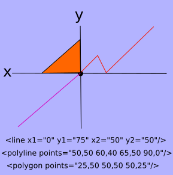

#Whats Behind the SVG viewBox?
A tutorial on the SVG viewBox

The viewBox is an attribute that we can add to our SVG to do some interesting things. A viewBox attribute has four parameters that can be separated by commas or spaces. They are min-x, min-y, width, and height. Lets explore how these settings effect our svg. If we use the following settings: ```viewBox="0 0 *svg-width* *svg-height*``` we will observe that the view box attribute has no effect on the way our svg looks. However, if we were to change the min-x and min-y values something interesting occurs. Lets say we had the following svg defined:

```
<svg width="500" height="250" viewBox="0 0 500 250"><circle fill="#231670" cx="50" cy="50" r="50"/><circle fill="#D922F2" cx="500" cy="250" r="50"/>
  </svg>
```
You may want to drop this code into [jsBin](https://jsbin.com/yoyip/4/edit?html,output) and add the following css in order to see what is going on.
 
 ```
 svg {
   border-style:solid;
   border-size:2px;
   border-color:red;
 }
 ```
 
 The first circle resides right inside the upper left corner of the svg and so we can see the complete circle. Only the upper left quadrant of the second circle is visible however because the center of the circle resides at the lower right corner point of the svg. We can manipulate the values of the view box min-x and min-y to make the second circle viable. Using the radius of the circle we determine that if we move it 50 units to the left and 50 units up it will be visible. So if we give the viewBox min-X and min-y properties a value of 50 our second circle will become fully visible. However, now only the lower right quadrant of our first circle is visible. Using the viewBox attribute this way, we are able to navigate a canvas much larger than our svg height and width. So we can define elements within our SVG who's coordinates are outside the coordinates contained inside the SVG. Then with the viewBox attribute we can transverse this extended area using the min-X and min-Y values.
 
 
 
 It is like the page is laying on top of a larger page and we have cut a rectangle in our page so we can slide our page in various directions, revealing what is under it as we go. By increasing the value of min-x, we are moving page across the page behind toward the right. By increasing the value of min-y, we moving our page down the down across the page behind. Neat huh. If our svg does not have any elements defined inside of it who's coordinates are outside the bounds of the width and height of the svg, then moving the view box around will not reveal anything new and would only potentially hide elements who's coordinates exist within the svg's width and height.
 
 When we start changing the width and height of the viewPort to settings that do not match those of the svg, things get a little harder to comprehend.
 
 If we leave our min-x and max-x values at 0(the upper left corner of the svg) and change the width to something other than the width of the svg, say something like 1500. Now we are seeing the scalable in svg at work. The circles both become visible as they become smaller in size. As we increase the values of the viewBox width and height, the shapes within the svg get increasingly smaller. But the circles do not stay at the extreme edges of the svg where we placed them, so not only do they shrink, but their position within the svg changes. What happens is that along with our circle size change comes a change in the the size of the reference points. When we change the width to 1500 If we decrease the width and height of the viewBox attribute below that of the svg our circles will grow larger will quickly move out of site, but only if both the width and height are decreased. Decreasing only one changes the position of the circles, but not the size.
  preserveAspectRatio

###CSS and SVGS
###JavaScript and SVGS
