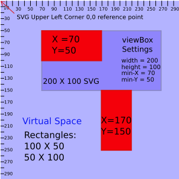

#Whats Behind the SVG viewBox?
A tutorial on the SVG viewBox

The viewBox is an attribute that we can add to our SVG to do some interesting things. A viewBox attribute has four properties that can be separated by commas or spaces. They are min-x, min-y, width, and height. Lets explore how these settings effect our svg starting with min-x and min-y. If we use the following settings: ```viewBox="0 0 *svg-width* *svg-height*``` we will observe that the view box attribute has no effect on the way our svg looks. However, if we were to change the min-x and min-y values something interesting occurs. Lets say we had the following svg defined:

```
<svg width="500" height="250" viewBox="0 0 500 250"><circle fill="#231670" cx="50" cy="50" r="50"/><circle fill="#D922F2" cx="500" cy="250" r="50"/>
  </svg>
```
You may want to drop this code into [jsBin](https://jsbin.com/yoyip/4/edit?html,output) and add the following css in order to see what is going on.
 
 ```
 svg {
   border-style:solid;
   border-size:2px;
   border-color:red;
 }
 ```
 
 The first circle resides right inside the upper left corner of the svg and so we can see the complete circle. Only the upper left quadrant of the second circle is visible however because the center of the circle resides at the lower right corner point of the svg. We can manipulate the values of the view box min-x and min-y to make the second circle visible. Using the radius of the circle we determine that if we move it 50 units to the left and 50 units up it will be visible. So if we give the viewBox min-X and min-y properties a value of 50 our second circle will become fully visible. However, now only the lower right quadrant of our first circle is visible. What this demonstrates is that we can move our SVG point of reference around within a much larger virtual space. Changing the value of min-X and min-Y to 50 moves the SVG 50 units to the right and 50 units down. So we learn two things from this example. One, the viewBox attribute controls the viewing area of the SVG. And two, the elements we define within our SVG can exist outside the width and height boundaries of the SVG in virtual space. Using the viewBox attribute this way, we are able to create a virtual space much larger than that of our SVG. To summarize, the min-X and min-Y properties of the viewBox attribute place the SVG inside a virtual space where the min-X and min-Y values correspond to the XY coordinates of the upper left corner of the SVG within that space. Increasing values of min-X move the SVG to the right and increasing values of min-Y move the SVG down. The relationship is illustrated below.
 
 
 
 Let's take another look at our two circle example where we moved the SVG 50 units right and 50 units down in order to expose the lower circle. By moving the SVG, we also end up covering part of the upper circle. So what if we wanted both circles in view at the same time. Intuitively we might think that we would merly need to increase the width and height of our viewBox and leave the position at 0,0. Try increasing the height on our JSBin example and you will be surprised to find that just changing the height to 300 exposes the entire lower circle and also leaves the upper circle exposed. But what happened to the upper circle. We only changed the viewBox height and the upper circle moved to the right the same number of units by which we increase the height. It turns out that, in our case, if we want to display both full circles simultaneously without transforming or moving them, we would need to change the height and width of the SVG. So what is going on here when we change the height of the viewBox element to a value larger than the SVG height? It will be easier see what happens if we add a rectangle with the same dimensions as our jsBin SVG. Set the width and height of the SVG back to 550 and 300 respectively. Then add the the following code as the last line inside of our SVG on jsBin. ```<rect x="0" y="0" width="550" height="300"/>``` Let's also set our second circle coordinates back to their original settings. Our SVG should now look like this: ```<svg width="550" height="300" viewBox="0 0 550 300"><circle fill="#231670" cx="50" cy="50" r="50"/><circle fill="#D922F2" cx="550" cy="300" r="50"/><rect x="0" y="0" width="550" height="300"/></svg>``` The rectangle will completely fill the area of our SVG. Now if we increase the viewPort height by 50, we can see that the lower circle comes into view with its upper left quadrant covered by the rectangle. Remember that without the rectangle, when the viewPort and SVG dimensions are equal, the upper right quadrant of the circle was all that was visible. Notice also that the rectangle is centered within the SVG border and 50 units of space separate the bottom of the rectangle from the SVG border. If we continue to increase the height value of our viewPort, we will find that the rectangle and the visible part of circle 2 continue to appear smaller, but their relationship whatever is above them stays the same. The rectangle stays attached to the top border and the circle remains attached to the rectangle. There are at least three ways to visualize what is happening here. I will point out the one I prefer to use when understanding the viewBox. By increasing the height value of our viewBox, we move the virtual space behind our SVG further away while maintaining the anchor point corresponding to the top of the SVG. All the additional virtual space added inside our SVG is limited to the area below the anchor point. A similar transformation occurs if we set the height of our viewBox to match the SVG and increase our viewBox width beyond the width of the SVG. Try it and you will see that the only difference in this case is that the anchor point with the left side of the SVG is maintained as the virtual space is expanded above, below and to the right. Consider the following images:
 
 
 
 Our viewBox width and height match the width and height of the SVG.
 
 
 
 Here we double the width of our viewBox height
 
  preserveAspectRatio

###CSS and SVGS
###JavaScript and SVGS
