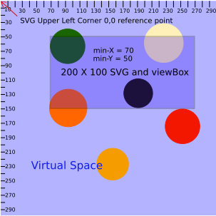

#Whats Behind the SVG viewBox?
A tutorial on the SVG viewBox *(a second in a series concerning SVGs)*

*Given the lack of resources available on the subject, writing a tutorial on the viewBox proved to be somewhat of a challenge. It required quite a bit of experimentation and analysis on my part. I hope that by reading this post you will save yourself quite a bit of time implementing the view box in your projects.*

###A Basic Description
The viewBox is an attribute that we can add to our SVG to do some powerful things. It provides us with an infinite land of virtual space in which to build an amazing user interface and experience. The viewBox attribute has four properties that can be separated by commas or spaces. They are **min-x**, **min-y**, **width**, and **height**. The following units can be used to define the values: em, ex, px, pt, pc, cm, mm, in, and percentages. If no unit is specified, px units are assumed. Lets explore how these settings effect our svg first by setting the viewBox height and width the same as the SVG height and width and varying the viewBox values for min-x and min-y. 

###X and Y
If we use the settings ```viewBox="0 0 svg-width svg-height``` we will observe that the view box attribute has no effect on the way our svg looks. However, if we we change the min-x and min-y values, things start to get interesting. Lets say we had the following svg defined:

    <svg width="500" height="250" viewBox="0 0 500 250">
        <circle fill="#231670" cx="50" cy="50" r="50"/>
        <circle fill="#D922F2" cx="500" cy="250" r="50"/>
    </svg>

You may want to drop this code into [jsBin](https://jsbin.com/yoyip/4/edit?html,output) and add the following css in order to visualize what is going on.
 
 ```
 svg {
   border-style:solid;
   border-size:2px;
   border-color:red;
 }
 ```
 
 The first circle resides right inside the upper left corner of the svg so we can see the complete circle. Only the upper left quadrant of the second circle is visible, however, because the center of the circle resides at the lower right corner point of the svg. We can manipulate the values of the view box **min-x** and **min-y** to make the second circle visible. Using the radius of the circle we determine that if we move it 50 units to the left and 50 units up it will be visible. So if we give the viewBox **min-X** and **min-y** properties a value of 50 our second circle will become fully visible. But, now only the lower right quadrant of our first circle is visible. What this demonstrates is that **we can move our SVG point of reference around within a much larger virtual space**. Changing the value of **min-X** and **min-Y** to 50 moves the SVG view 50 units to the right and 50 units down. So we learn two things from this example. One, the **viewBox attribute controls the viewing area of the SVG**. And two, **the elements we define within our SVG can exist outside the width and height boundaries of the SVG in virtual space**. Using the viewBox attribute this way, we are able to create a virtual space much larger than that of our SVG. In summary, the min-X and min-Y properties of the viewBox attribute make the SVG a a window into virtual space where the min-X and min-Y values correspond to the placement of the upper left corner of the window within that space. Increasing values of min-X move the window to the right and increasing values of min-Y move the window down. The relationship is illustrated below.
 
 
 
 **Figure A**
 
 Referring back to our JSBin example, what if we wanted to expand our window to include both of our circles simultaneously. We might try to merely increase the width and height of our viewBox to give us a larger view of our virtual space. Set min-y and min-x back to 0. Then set the viewBox height to 300. This will exposes the entire lower circle and also leave the upper circle exposed. But what happened to the position of the upper circle? We only changed the viewBox height and the upper circle appears to have moved to the right. That's not what we want. Why did the virtual space expand horizontally as well as vertically? It will be easier see what happens if we add a rectangle with the same dimensions as our SVG. Add the the following code as the last line inside of our SVG.
  
     <rect x="0" y="0" width="550" height="300"/>
 Let's also set our second circle coordinates back to their original settings. Our SVG should now look like this:
 
    <svg width="550" height="300" viewBox="0 0 550 300">
        <circle fill="#231670" cx="50" cy="50" r="50"/>
        <circle fill="#D922F2" cx="550" cy="300" r="50"/>
        <rect x="0" y="0" width="550" height="300"/>
    </svg>

 The rectangle will completely fill the area of our SVG. Now if we increase the viewPort height by 50, we can see that the lower circle comes into view with its upper left quadrant covered by the rectangle. Remember that without the rectangle, when the viewBox and SVG dimensions are equal, the upper right quadrant of the circle was all that was visible. Notice also that the rectangle is centered within the SVG border and 50 units of space separate the bottom of the rectangle from the SVG border. If we continue to increase the height value of our viewPort, we will find that the rectangle and the visible part of circle 2 continue to appear smaller, but their spacial relationships with other elements stay the same. The rectangle stays attached to the top border and the circle remains attached to the rectangle. By increasing the height value of our viewBox, we move the virtual space behind our SVG further away while maintaining the anchor point corresponding to the top of the SVG. All the additional virtual space added inside our SVG is limited to the area below the anchor point. The space added to the width is split evenly between the right and the left sides of the SVG Y axis. Yes I did say the left side of the Y axis.
 
 A similar expansion occurs if we set the height of our viewBox to match the SVG and increase our viewBox width beyond the width of the SVG. Try it and you will see that the only difference in this case is that the anchor point with the left side of the SVG is maintained as the virtual space is expanded above, below and to the right. Consider the following images:
  
  In the image below our viewBox height and width match that of the SVG. Notice how min-x and min-y values move the view box around within a larger virtual space. As you will see later, it is also important to note how the x and y values of the shape elements are mapped here within the SVG.
  
  
  
  **Figure B** The lower rectangle is not visible because its coordinates place it outside the window.
  
  
  
  **Figure C** The view box height is twice that of the SVG height. All other settings unchanged. Making the lower rectangle visible even though its position values have not been changed.
  
###ViewBox Coordinates System
Probably, the hardest thing to grasp about the view box is the coordinates system. In order to aid in our discourse regarding SVG coordinates I will use something I like to call codespeak ( *not urban dictionary flavor of codespeak* ). We describe some terms and then define some relationships using symbols familiar to coders. Using the relationships we can describe some rules to aid us in understanding the coordinates and ultimately obtaining the desired results for the placement and scaling of our graphics.
 
     LET Wsvg = SVG width attribute value
     LET Hsvg = SVG height attribute value
     LET Wvb = viewBox width value
     LET Hvb = viewBox height value
     LET VSy(+) = Virtual Space below X axis
     LET VSy(-) = Virtual Space above X axis
     LET VSx(+) = Virtual Space right of the Y axis
     LET VSx(-) = Virtual Space left of the Y axis + Wsvg
     
     IF Wsvg = Wvb && Hvb > Hsvg THEN
       VSy(+) = Hvb &&
       VSx(-) = -((Wsvg/Hsvg) * (Hvb - Hsvg))/2 &&
       VSx(+) = Wvb + ((Wsvg/Hsvg) * (Hvb - Hsvg))/2
       
     IF Hsvg = Hvb Wvb > Wsvg THEN
       VSx(+) = Wvb &&
       VSy(-) = -((Hsvg/Wsvg) * (Wvb - Wsvg))/2 &&
       VSy(+) = ((Hsvg/Wsvg) * (Wvb - Wsvg))/2
       
     Rule 1  
     IF Wsvg/Hsvg = Wvb/Hvb THEN
       VSy(+) = Hvb && VSy(-) = 0 && VSx(+) = Wvb && VSx(-) = 0
     Rule 2  
     IF Wsvg/Hsvg > Wvb/Hvb THEN
       VSy(-) = 0 && VSy(+) = Hvb && VSx(-) = ((Wsvg/Hsvg - Wvb/Hvb) * Hvb)/2
     Rule 3  
     IF Wsvg/Hsvg < Wvb/Hvb THEN
       VSx(-) = 0 && VSx(+) = Wvb && VSy(-) = ((Hsvg/Wsvg - Hvb-Wvb) * Wvb)/2
    
The first thing to recognize about the coordinates system with SVG's is that it is not a coordinates system. It is the coordinates system**s**. The first coordinates system is that of the outer SVG and the second is the coordinates of the viewBox. I suppose we could refer more coordinates systems within systems as we nest SVG elements but I think it is best to leave that out of this tutorial. So for our purposes we are concerned with just one outer SVG and the coordinates of this system refer only to the placement of the elements that it contains within virtual space. So we can say that the outer SVG coordinates system maps to our virtual space. Referring back to our figures, we can see the lower left quadrant of the SVG coordinates system. But we do have four full quadrants of virtual space in which to place our child SVG's.

####Which way is up? 
Positive values of X extend to the right of the Y axis as is normal. However, positive values of Y extend below the X axis which departs from what we would expect in a four quadrant system. Normally positive values for Y would be found above the X axis. This might not be a big deal if our coordinates never extended above the X axis, but the coordinates do extend above the X axis as well as to the left of the Y axis. So our negative values of Y extend above the X access and our negative values for X extend to the left of the Y axis as expected.

####Where is the middle?
To further complicate things, when our view box comes along, the middle of our coordinates system (0,0) can be placed anywhere. Where it exists is dependent on the placement of the view within the SVG.

#####Virtual Space Center
When we define our outer SVG, the intersection of virtual X and Y access is fixed so with regards to virtual space, the center of our coordinates always refers back to the upper left corner of the SVG as specified by the width and height attributes. Remember, however that positive points on the Y access exist below the X axis and not above it. See the quadrants of the virtual space illustrated below.

 
  
  **Figure D** Virtual coordinates XY intersection fixed by the upper left corner of the outer SVG

The virtual coordinates center will not change, so we can safely add and manipulate all our svg elements within the parent with confidence that the spacial relationships will remain consistent. Since the specific values of width and height for our parent SVG only refer to our window into virtual space and how much space the SVG uses on the page, they do not affect the position of virtual (0,0). All that matters, is that width an height values greater than 0 exist. Of course it does not matter what we have in virtual space if we can not see it, so unless we can make the outer SVG large enough to contain all of the virtual space, we are going to need the viewBox.

#####viewBox Coordinates Center (0,0)

Our viewBox system is movable. It is our understanding of this movement that is key to mastering the coordinates systems. Recall that when our viewBox min-x and min-y properties are set to 0 (or not specified at all) and the height and width are set the same as the SVG, the viewBox reveals the virtual space from the top left corner of the SVG to the right width number of units and down for height number of units. At these settings our viewBox coordinates are setting right on top of our virtual space coordinates as illustrated in figure D above. We all so learned that if the width and height of our view box are equal to the SVG, we can use the min-y and min-x properties of the view box to pan our view of virtual space at scale. With these settings our view box takes control of the position within virtual space of our SVG. Our viewBox coordinates are shifted by the values of min-x and min-y and it takes the outer SVG with it as illustrated below.


  
  **Figure E** Centering the ViewPort in virtual space by setting the viewBox properties using the formulas min-x = -(Wvb/2) and min-y = -(Hvb/2)
 
As illustrated above, the viewBox min-x and min-y settings refer to the point within virtual space to which the upper left corner of the SVG is anchored. So we can see that the center point for the viewBox coordinates resides at Virtual space center plus the offset provided by the min-x and min-y attributes, if they exist. We can represent this as ```vb(0,0) = vs(0,0) + (min-x, min-y)```. Ok, that's pretty easy. Now for the trickier stuff. 
 
###Manipulating viewBox coordinates
It is not until we start changing the one to one relationship between SVG width/height and viewBox width/height that cause manipulations to the viewBox coordinates system. Lets say we increase the ratio of our viewBox width/height to twice that of the SVG width/height. We will notice that while more virtual space is added to our viewport, our view box is no longer centered in virtual space. We can fix that with our min-x and min-y settings by recalculating their values with the new values for width and height. ```(-(Wvb/2),-(Hvb/2))``` This formula will always position our viewBox coordinates center at the center of virtual space. This makes navigating around virtual space and positioning our elements within virtual space a close to 'normal' experience. Now we can pan our larger view of virtual space easily by offsetting our (0,0) point with positive values to the right of the Y axis and negative values to the left of the Y axis. And our positive values of Y while still reversed will proceed out from the X axis albeit up instead of down and the negative values of Y will extend above the X axis. And when we set the X and Y values of our inner elements, they will be consistently found where expected; exactly X units from the Y axis and Y units from the X axis like they should. As long as we always recalculate our center whenever we change the viewBox width and height, we can be sure everything in virtual space will be found at the expected coordinates with respect to (0,0). We can expect this whether we zoom in by decreasing the viewBox width/height below the SVG width/height or increasing the viewBox width/height values above those of the SVG. We can increase/decrease the viewBox width/height independently of each other and still count on our center of virtual space to be at ```(-(Wvb/2),-(Hvb/2))```. When we adjust our viewBox width and height proportionately, we can also count on the bounderies of virtual XY that is viewable within our viewport to also be consistent. ```X = -vbW through vb
 
 
  preserveAspectRatio

###CSS and SVGS
###JavaScript and SVGS
